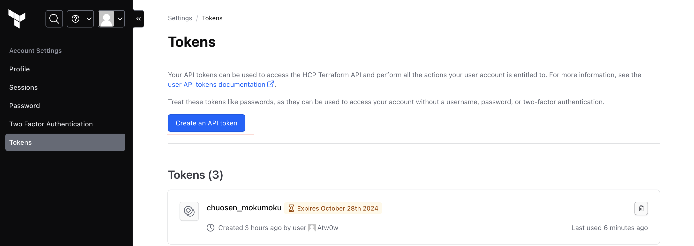

# terraform-tfe-templates

## これは何?

HCP Terraform のワークスペースの作成 〜 HCP Terraform 上で Plan, Apply までを実施する。
今回は AWS のリソースを作成する。

## 実行手順

- このリポジトリをローカルに clone する

- 事前に以下のリポジトリを用意する

  - **GitHub リポジトリ A** ... terraform を実行するためのテンプレート。テンプレートは[こちら](https://github.com/atsw0q0/test-terraform-cloud)を使用する。

- トークンの払い出し (HCP Terraform を利用するための API トークン)
  

- `terraform.tfvars`を作成. 以下のように設定する

```hcl:terraform.tfvars
org_manager_email          = "自分のメールアドレス"
token                      = "HCP Terraform のAPI トークン"
vcs_repository             = "上記GitHub リポジトリ A"              # [username]/[repository_name]"
github_app_installation_id = "Github App OAuth Token"             # ghain-xxxx

# ↓ 「GitHub リポジトリ A」のvariablesに渡したい引数とかをここに定義
pj_tfm_vars = {
  name = "chuosen"
  env  = "test"
}
```

- terraform 実行. HCP Terraform 上で AWS リソースを Plan/Apply されていることを確認.

```sh
# 初期化
terraform init

# Dry-Run
terraform plan

# 作成
terraform apply
```

- 後始末

```sh
# リソース削除
terraform destroy
```

<!-- BEGIN_TF_DOCS -->

## Requirements

| Name                                                   | Version   |
| ------------------------------------------------------ | --------- |
| <a name="requirement_tfe"></a> [tfe](#requirement_tfe) | ~> 0.58.1 |
| <a name="requirement_tfe"></a> [tfe](#requirement_tfe) | 0.58.1    |

## Providers

| Name                                             | Version |
| ------------------------------------------------ | ------- |
| <a name="provider_aws"></a> [aws](#provider_aws) | 5.69.0  |
| <a name="provider_tfe"></a> [tfe](#provider_tfe) | 0.58.1  |

## Modules

No modules.

## Resources

| Name                                                                                                                                                 | Type        |
| ---------------------------------------------------------------------------------------------------------------------------------------------------- | ----------- |
| [aws_iam_openid_connect_provider.terraform](https://registry.terraform.io/providers/hashicorp/aws/latest/docs/resources/iam_openid_connect_provider) | resource    |
| [aws_iam_role.role](https://registry.terraform.io/providers/hashicorp/aws/latest/docs/resources/iam_role)                                            | resource    |
| [tfe_organization.test](https://registry.terraform.io/providers/hashicorp/tfe/0.58.1/docs/resources/organization)                                    | resource    |
| [tfe_project.aws](https://registry.terraform.io/providers/hashicorp/tfe/0.58.1/docs/resources/project)                                               | resource    |
| [tfe_variable.env_tfc_aws_provider_auth](https://registry.terraform.io/providers/hashicorp/tfe/0.58.1/docs/resources/variable)                       | resource    |
| [tfe_variable.env_tfc_aws_run_role_arn](https://registry.terraform.io/providers/hashicorp/tfe/0.58.1/docs/resources/variable)                        | resource    |
| [tfe_variable.tfm_hcl_pj_tag](https://registry.terraform.io/providers/hashicorp/tfe/0.58.1/docs/resources/variable)                                  | resource    |
| [tfe_workspace.mokumoku](https://registry.terraform.io/providers/hashicorp/tfe/0.58.1/docs/resources/workspace)                                      | resource    |
| [tfe_workspace_settings.mokumoku](https://registry.terraform.io/providers/hashicorp/tfe/0.58.1/docs/resources/workspace_settings)                    | resource    |
| [aws_caller_identity.current](https://registry.terraform.io/providers/hashicorp/aws/latest/docs/data-sources/caller_identity)                        | data source |

## Inputs

| Name                                                                                                               | Description                                                              | Type                                                             | Default                                                        | Required |
| ------------------------------------------------------------------------------------------------------------------ | ------------------------------------------------------------------------ | ---------------------------------------------------------------- | -------------------------------------------------------------- | :------: |
| <a name="input_github_app_installation_id"></a> [github_app_installation_id](#input_github_app_installation_id)    | select your vcs repository                                               | `string`                                                         | n/a                                                            |   yes    |
| <a name="input_hostname"></a> [hostname](#input_hostname)                                                          | hostname                                                                 | `string`                                                         | `"app.terraform.io"`                                           |    no    |
| <a name="input_is_create_iam_oidc_provider"></a> [is_create_iam_oidc_provider](#input_is_create_iam_oidc_provider) | if app.terraform.io of IAM OIDC Provider is already exists, select false | `bool`                                                           | `false`                                                        |    no    |
| <a name="input_org_manager_email"></a> [org_manager_email](#input_org_manager_email)                               | Organizaitons Manager E-Mail                                             | `string`                                                         | n/a                                                            |   yes    |
| <a name="input_pj_tags"></a> [pj_tags](#input_pj_tags)                                                             | n/a                                                                      | <pre>object({<br/> name = string<br/> env = string<br/> })</pre> | <pre>{<br/> "env": "test",<br/> "name": "mokumoku"<br/>}</pre> |    no    |
| <a name="input_pj_tfm_vars"></a> [pj_tfm_vars](#input_pj_tfm_vars)                                                 | set workspace variables as tfm hcl                                       | `map(any)`                                                       | `{}`                                                           |    no    |
| <a name="input_token"></a> [token](#input_token)                                                                   | HCP Terraform API Token                                                  | `string`                                                         | n/a                                                            |   yes    |
| <a name="input_vcs_repository"></a> [vcs_repository](#input_vcs_repository)                                        | select your vcs repository                                               | `string`                                                         | n/a                                                            |   yes    |

## Outputs

No outputs.

<!-- END_TF_DOCS -->
